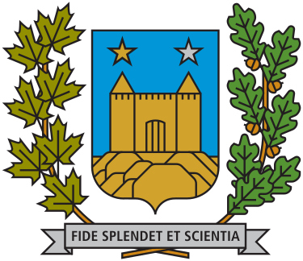
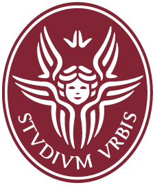
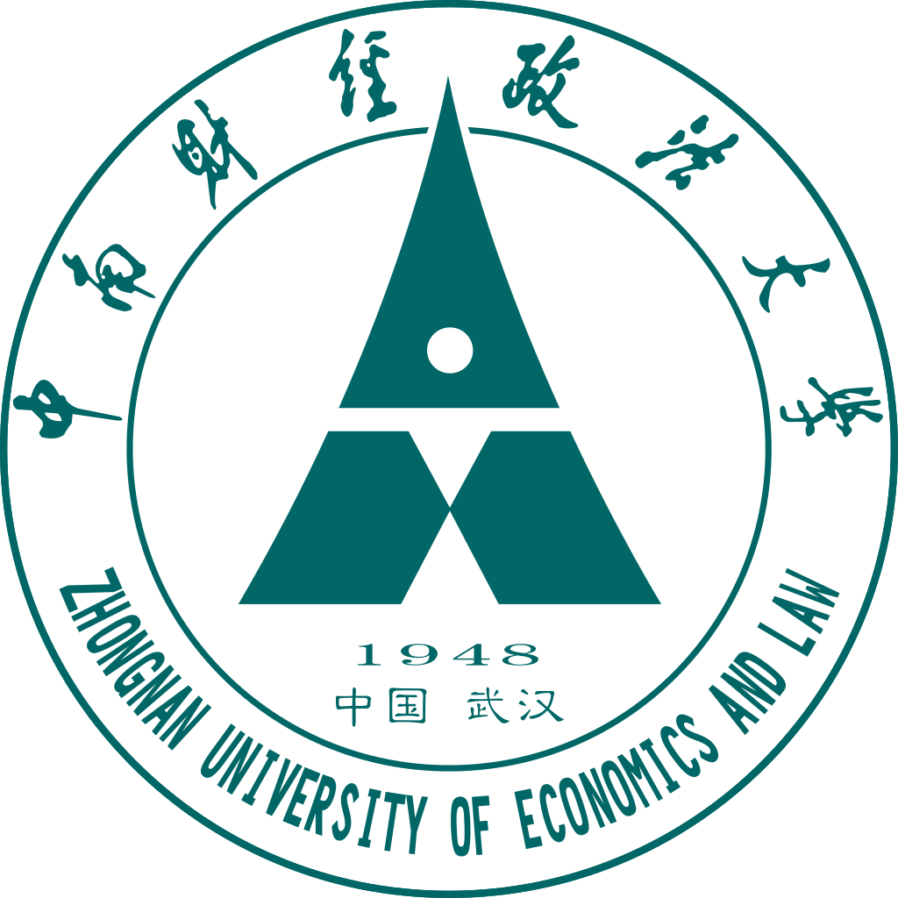

## About Me

I am a fourth-year Ph.D. candidate at the Faculty of Law, University of Montreal, exploring the intersection of Artificial Intelligence and Law. As a member of the [Cyberjustice Laboratory](https://www.cyberjustice.ca/) and under the supervision of [Prof. Karim Benyekhlef](https://www.karimbenyekhlef.ca/), my research focuses on leveraging AI to improve the accessibility, fairness, and efficiency of the justice system.

My work applies AI to the legal domain across three core themes: **(1) AI-powered Legal Information Systems**, **(2) Intelligent Dispute Resolution Support**, and **(3) AI-driven Identifying, Verifying, and Mitigating Flaws in Judicial Decision-Making.**

I have published and presented my research at several international conferences. Notably, my co-authored paper received the **[Best Paper Award](https://jurix23.maastrichtlawtech.eu/proceedings/)** at the International Conference on Legal Knowledge and Information Systems (JURIX) 2023, with further recognition at the [ICAIL 2023](https://icail2023.di.uminho.pt/) workshops and [JURIX 2024](https://jurix2024.law.muni.cz/).

I am always open to new collaborations—feel free to get in touch if you'd like to connect!

## Research Interests

- **Artificial Intelligence and Law**, Large Language Models, Access to Justice, Judicial Behavior

## News

- **[Dec. 2025]** Presented *Enhancing Judicial Autonomy Using Artificial Intelligence* at the University of Hong Kong Faculty of Law. 🏛️
- **[Dec. 2025]** Presented *LegalWebAgent: Empowering Access to Justice via LLM-Based Web Agents* at the **AIDA2J Workshop** at JURIX 2025, Turin. 🤖⚖️
- **[Dec. 2025]** Presented *LLMediator* at the **2025 International Conference on Computational Law** in Shanghai. 🇨🇳
- **[Nov. 2025]** Participated in the **6th Social Science Law Research Camp & "Law and Social Science" Annual Meeting** at Zhongnan University of Economics and Law, Wuhan. 🎓
- **[Nov. 2025]** I will be presenting on the topic "AI & Mediation" at the [27th Annual ODR Cyberweek 2025](https://odr.info/). 🤖⚖️
- **[Oct. 2025]** I will be participating in the **Young Researchers Panel: "AI&Tech, Justice & Politics"** at the [ACT Partnership Conference 2025](https://www.ajcact.org/en/conference-2025/), discussing the autonomy of judicial actors in the AI era. 🔶⚖️
- **[May. 2025]** I will be presenting my latest research on **AI and judicial decision-making** at the [7th Annual Meeting of Young Researchers in Digital Law](https://www.obvia.ca/evenements/7e-edition-rencontre-des-jeunes-chercheuses-et-chercheurs-en-droit-numerique)! 🧠⚖️
- **[Mar. 2025]** Excited to share our work on **LLMediator**, a project using LLMs to support dispute resolution, featured in a public event on [AI's legal implications in the business world](https://www.crdp.umontreal.ca/nouvelles/2025/03/12/au-dela-du-battage-mediatique-les-incidences-juridiques-de-lia-en-entreprise/). 🤖🤝  
- **[Oct. 2024]** Paper "Robots in the Middle: Evaluating LLMs in Dispute Resolution" has been accepted by JURIX 2024. You can watch my talk [here](https://www.youtube.com/watch?v=VxQiBbgWMb4&t=614s). 🎥  
- **[Dec. 2023]** Paper "From Text to Structure: Using Large Language Models to Support the Development of Legal Expert Systems" won the Best Paper Award at JURIX 2023. 🎉





## Education

  
  

    Ph.D. in Innovation, Science, Technology and Law, University of Montreal (2022 - Present)
  

  
  

    M.A. in European Law, Sapienza University of Rome (2019 - 2021)
  

  
  

    B.A. in Law, Zhongnan University of Economics and Law (2015 - 2019)
  

<!--  

-->

<!--  

-->
